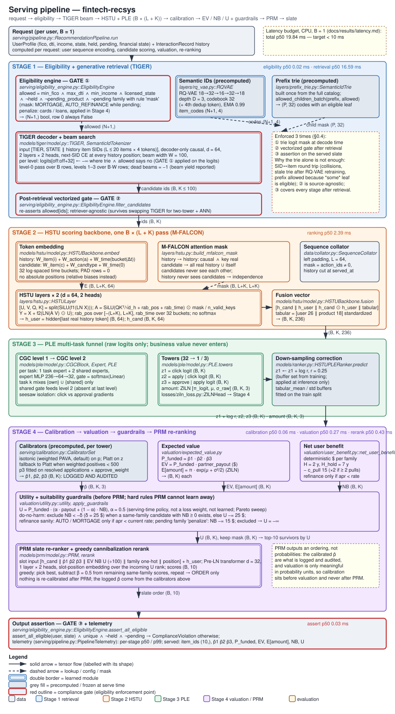
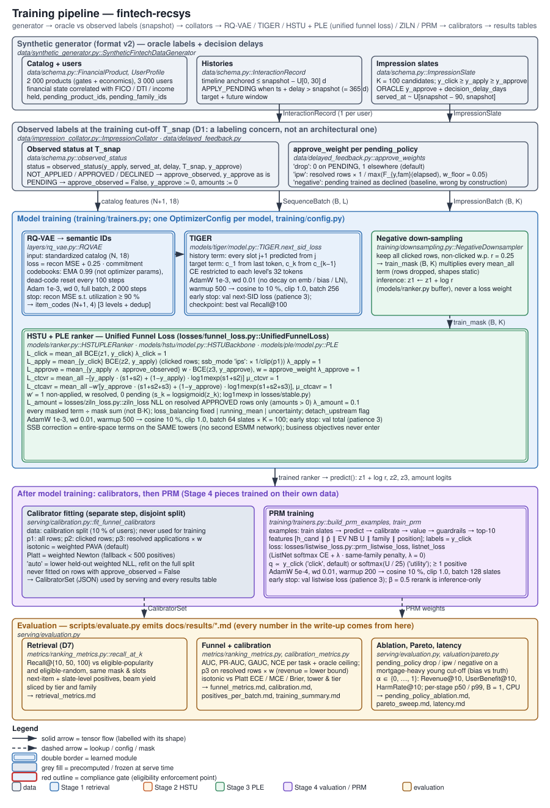

# fintech-recsys

A four-stage credit-marketplace recommender (credit cards, balance-transfer cards, personal
loans, auto refinance, mortgages) built for hard underwriting compliance, honest
probabilities and a CPU scoring budget. Eligibility is enforced three times (a prefix-trie
logit mask at generation, a post-retrieval gate, an output assertion); every learned
probability is a proper-scoring-rule estimate that is calibrated before it is turned into
dollars; business policy (`α`, guardrails, family diversity) lives at valuation and
re-ranking time, never in a loss.

1. **TIGER generative retrieval** over RQ-VAE Semantic IDs, beam width 100, with the trie
   masking every code that cannot end in an eligible product.
2. **HSTU scoring backbone** that scores the 100 candidates in one batched `B × (L + K)`
   pass with an attention mask that keeps candidates independent of each other.
3. **PLE multi-task funnel** (`p(click)`, `p(apply | click)`, `p(approve | apply)`, ZILN
   amount) trained with a unified funnel loss whose entire-space terms are written in log
   space on the same towers; pending applications are a labeling concern (`pending_policy`).
4. **Calibration → valuation → guardrails → PRM**: isotonic / Platt per tower, expected value
   and a deterministic net user benefit combined under a serving-time `α`, suitability
   guardrails, and a Pre-LN transformer re-ranker that outputs an ordering only.

The full design-review write-up, with placement rationale for every component, the decision
register and the failure-mode table, is **[`docs/ARCHITECTURE.md`](docs/ARCHITECTURE.md)**.
Every number there and below is copied from `docs/results/` (asserted by `tests/test_docs.py`).





## Install

```bash
python3 -m venv .venv
.venv/bin/pip install -e ".[dev]"
```

## Quickstart

```bash
# 1. Generate a format-v2 dataset (delayed feedback, extended economics)
.venv/bin/python scripts/generate_dataset.py --out data/generated
# 2. Train every stage and save the serving artifacts
.venv/bin/python scripts/train_all.py --data data/generated --out artifacts
# 3. Evaluate: writes docs/results/*.md (retrieval, funnel, calibration, ablation, Pareto, latency)
.venv/bin/python scripts/evaluate.py --data data/generated --artifacts artifacts
# 4. Serve a few users end to end with per-stage latency
.venv/bin/python scripts/run_e2e_pipeline.py --data data/generated --artifacts artifacts --serve-users 5
# Quality gate
.venv/bin/python -m pytest -q && .venv/bin/python -m mypy && .venv/bin/python -m ruff check . && .venv/bin/python scripts/check_diagrams.py
```

## Headline results

Synthetic benchmark: 2 000 products, 3 000 members, 1.2 M impression rows, members split
2100 / 300 / 300 / 300 (train / val / calib / test). Sources: `docs/results/*.md`.

<!-- source: docs/results/retrieval_metrics.md, funnel_metrics.md, pareto_sweep.md, latency.md -->
| metric | value | baseline / ceiling |
|---|---|---|
| Retrieval `Recall@100` (TIGER beam, eligible next-item positives) | 0.3379 | eligible-popularity 0.3836, eligible-random 0.1598 |
| Retrieval `Recall@10` | 0.0868 | eligible-popularity 0.0548 |
| Click AUC (calibrated) / ECE | 0.5353 / 0.0019 | oracle ceiling 0.6316 |
| Apply-given-click AUC / ECE | 0.5754 / 0.0117 | oracle ceiling 0.6143 |
| Approve-given-apply AUC / ECE | 0.7843 / 0.0280 | oracle ceiling 0.9251 |
| Pareto at `α = 0.5`: revenue / user benefit / harm per slate ($) | 35.97 / 437.31 / 0.000 | `α = 1`: 47.41 / 308.46 / 0.160 |
| Pending-policy bias on the mortgage slice (`drop` / `ipw` / `negative`) | 0.0659 / 0.1721 / -0.5909 | truth 0.6255 |
| Serving latency p50, CPU, `B = 1` | 19.84 ms | target 10 ms; retrieval alone 16.5931 ms |
| Eligibility violations in served slates | 0 | asserted by the pipeline |

The latency target is missed by the TIGER beam (the decoder re-runs the history at each of
four levels for 100 beams); the write-up analyzes the gap and the KV-cache mitigation rather
than hiding it.

## Layout

```
src/recsys/data        schema (single source of truth), generator, collators, delayed feedback
src/recsys/layers      RQ-VAE, prefix trie, HSTU, transformer blocks
src/recsys/models      tiger/, hstu/, ple/, prm/, ranker.py
src/recsys/losses      unified funnel loss, ZILN, listwise, stable log-space helpers
src/recsys/serving     eligibility engine, calibration, valuation stage, pipeline, evaluation
src/recsys/valuation   expected value, net user benefit, utility + guardrails, Pareto sweep
src/recsys/training    configs + decision register, optimizers, splits, trainers
scripts/               generate_dataset, train_all, evaluate, pareto_sweep, run_e2e_pipeline, check_diagrams
docs/                  ARCHITECTURE.md, diagrams/, results/
tests/                 127 tests; tests/test_docs.py ties the write-up to the code and results
```
